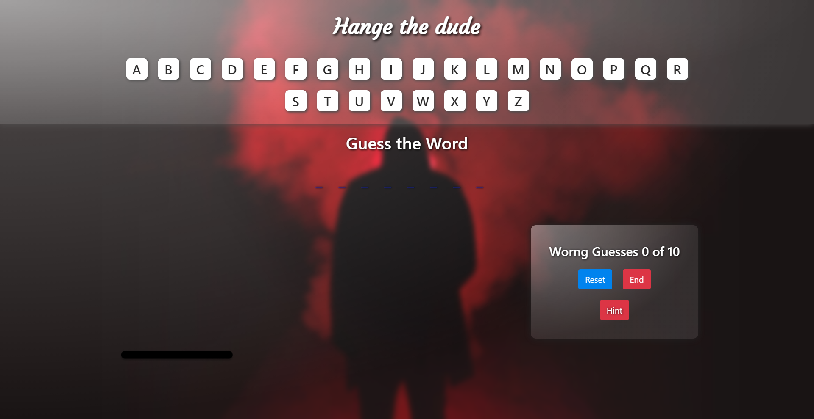

# Hang the dude 
## Overview
Screen shot of the game

### Game rules

1. you wall have 10 chances to save a man from hanging.

2. You can get 2 letter hints from index 3 and 4 .

3. Every time you restart the the word will be changed

### Have a good time and please read the letters when you lose or win.

# How to install

1. First clone the project.

2. cd into the folder (cd hangman_react_js)

3. cd into hangman folder (cd hangman).

4. command (yarn) or (npm install)

5. command (yarn start) or (npm start) and have fun !!
